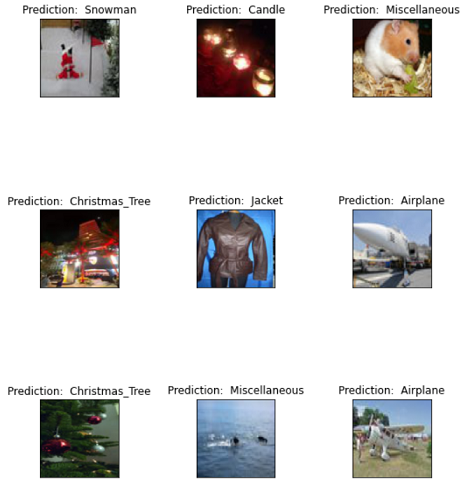

# Hackerearth_Image_classification

## Problem Statement
An e-commerce platform is getting all geared up for a season clearance sale and plans to leverage social media as the primary channel to reach their audiences. The campaign’s target group are individuals/families that have recently posted a picture of their indoor Christmas decor or are traveling during the holidays.

In this project we have been tasked to build a product recommendation engine for consumers. Our role is to use Deep Learning to develop a model that classifies images based on elements within the picture. These elements should be related to decor or holiday season vacations, such as a snowman, a Christmas tree, flights, and the like.

[Link to the competition](https://www.hackerearth.com/challenges/competitive/hackerearth-deep-learning-challenge-holidays/)

[Link for the trained model](https://drive.google.com/file/d/1eUO3e6_RVYYsW3WiynUKQBI6BA681Xaj/view?usp=sharing)

## Results

Following are some of the predictions by the trained model   
 
